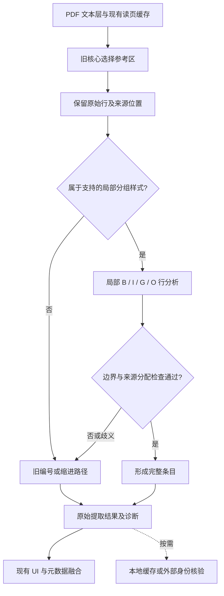

# Refs 参考文献算法调研与融合决策

核验日期：2026-09-10。本文区分外部一手证据、本轮已验证的实现和后续设计。本轮局部融合对应 1.2.4，已经完成代码、开发语料及隔离 Zotero 验证。发布状态以 [GitHub Releases](https://github.com/yimmy23/zotero-refs/releases) 为准。开发者本地审计证据位于 `.scaffold/review/hybrid-core-20260910/`，原始 PDF 和逐条核验材料不随代码仓库公开。

本轮保留旧核心的参考区选择和成熟的编号处理，把实验新核心的行级状态、来源追踪与歧义处理用于局部重分段。已实现的路径是：**旧 selector → 局部分组参考区的 B/I/G/O 分析 → 来源行分配校验 → 接受或返回旧合并路径**。其中“来源行”指旧核心已经预处理并选中的行，不代表原始 PDF 字形层的完整覆盖。

## 一手证据及其适用边界

下面均为论文正文或项目官方资料。论文中的方法可作为设计依据；其分数不等于 Refs 的预期成绩，也不能证明跨文章续页问题已经解决。

| 来源                                                                                                     | 已核实的方法或结果                                                                                                                | 对 Refs 的意义与限制                                                                                                                                                    |
| -------------------------------------------------------------------------------------------------------- | --------------------------------------------------------------------------------------------------------------------------------- | ----------------------------------------------------------------------------------------------------------------------------------------------------------------------- |
| [GROBID：How GROBID works](https://grobid.readthedocs.io/en/latest/Principles/)                          | 级联处理文档区域、参考条目和字段；保留文本、字体、位置等 layout tokens；整篇区域分析采用行级表示，局部再做细粒度处理。            | 支持分层与来源保留。完整实现含 PDF 解析器和训练模型，不能直接视为纯 JS 规则；该说明包含历史性的模型与性能判断。                                                         |
| [Kern / Klampfl，2013](https://www.dlib.org/dlib/september13/kern/09kern.html)                           | 在其生物医学测试集上，参考字符串分段 F1 从原始文本路径的 87.5%，经栏、阅读顺序和页眉页脚预处理到 90.5%，再加间距与缩进到 93.7%。  | 是布局信息有价值的直接对照证据。但评价排除了未提取出任何引文的文档，并按作者、题名、年份 token 重合做映射；不是逐字符精确率。不能搬用其增益为 Refs 承诺。               |
| [CERMINE 原始论文，2015](https://link.springer.com/article/10.1007/s10032-015-0249-8)                    | 表示页、区、行、词及坐标；参考区内用 K=2 行聚类区分首行和续行，特征涉及行长、缩进、上方间距、编号和前行句点。                     | 可借鉴相对几何特征。其首行定簇假设会被续接页、组标题破坏；整体元数据平均 F 值 77.5% 不是条目边界准确率，分段步骤未单独定量评价。                                        |
| [ParsCit 原始论文，2008](https://clgiles.ist.psu.edu/pubs/LREC2008-ParsCit.pdf)                          | 分开括号标记、裸数字、无标记三种样式；无标记条目综合作者开头、上一行长短和终止标点；字段解析采用 CRF。                            | 支持按可观察样式路由。其主要实验是三个计算机领域引文字符串数据集的 CRF 字段解析，不能当作复杂 PDF 全流程性能。                                                          |
| [AnyStyle 官方仓库](https://github.com/inukshuk/anystyle)                                                | Finder 与 Parser 分开，可分别训练；同时提供整条与 token 错误率。默认训练材料主要是英语。                                          | 借鉴模块边界与评价方法。现成实现有 Ruby 等依赖；官方说明其分词方法不兼容中文等不靠空格分词的文字，不适合整体替换中文提取路径。                                          |
| [Körner，2017：Line-Based CRFs](https://arxiv.org/html/1705.08154v1)                                     | 提出 B-REF、I-REF、O-REF、O 四种行标签；O-REF 表示跨页条目中插入的页码等非引文行。参考区身份可作为特征，减少前级漏选的影响。      | 启发行状态与可跳过噪声设计。这是方法型预印本，正文没有定量实验；不能声称其准确率或速度已被实验证明。                                                                    |
| [An End-to-End Pipeline for Bibliography Extraction，2023](https://aclanthology.org/2023.wiesp-1.12.pdf) | 规则先选候选页，LiLT 检测参考区，微调 SciBERT 拆条并保留换行。其 PDFlib 路径的 citation F1 为 94.6%，PyMuPDF 路径为 92.8%。       | 支持规则、布局与序列模型组合，也显示上游 PDF 表示会影响结果。测试是 Elsevier 内部 2020 年后英文 born-digital 数据；94.6% 不是普遍准确率，未验证旧中文期刊或本项目文库。 |
| [XY-Cut++，2025](https://arxiv.org/html/2504.10258v1)                                                    | 暂存跨栏宽元素，再分区排序并放回；利用相对尺寸和局部密度处理复杂布局。论文排序实验报告平均 514 FPS，硬件为 Xeon / 256 GB。        | 可借鉴跨栏元素与局部排序。完整流程依赖上游布局标签；该速度不是 Zotero 端到端速度，作者仍指出嵌套子页面局限。                                                            |
| [ParsRec，2018](https://arxiv.org/abs/1811.10369)                                                        | 按引文字符串或字段选择更合适的解析器；在 105k 条化学引文上评价多解析器推荐。                                                      | 支持“不同样式可用不同策略”的方向，但解决的是给定引文字符串的字段解析，不负责 PDF 参考区归属；不能据此直接对两个 PDF 核心结果取并集。                                    |
| [GROBID：Consolidation](https://grobid.readthedocs.io/en/latest/Consolidation/)                          | 把原始提取与外部匹配补全分开，记录匹配状态和服务来源；Crossref 搜索结果需要后验核验，逐条补全可能使网络成为主要耗时。             | “能搜到”不等于同一篇文献。联网核验应按需、缓存和限流，不能阻塞本地提取或因未收录而判错。                                                                                |
| [GROBID：End-to-end evaluation](https://grobid.readthedocs.io/en/latest/End-to-end-evaluation/)          | 分别评价字段和完整条目，区分严格、宽松文本匹配；公布配置含 DeLFT 和 biblio-glutton。官方说明 XML/PDF 差异与金标准缺失会影响成绩。 | 回归必须记录输入、模型和匹配口径；不能把带外部补全的模型结果归为纯本地规则成绩。宽松匹配也不能掩盖连字符、数字或尾部丢失。                                              |

## 旧核心与实验新核心：问题归属

项目内依据来自现行 [旧核心说明](legacy-parser.md)、开发语料对比及逐条源文核验。以下问题应分开解决，避免把一次计数变化解释成全流程改善。

| 层次           | 已观察到的问题或明确风险                                                                            | 本轮处理方式                                                                                                                   |
| -------------- | --------------------------------------------------------------------------------------------------- | ------------------------------------------------------------------------------------------------------------------------------ |
| 参考区选择     | 合订 PDF、补充材料和跨文章续页可含多个参考目录；最后一个目录不一定属于目标论文。                    | 近期保留旧 selector。本轮局部拆条不能被描述成已解决整篇归属。                                                                  |
| 条目边界       | 左对齐、无编号作者—年份列表曾被过度拆分；按研究分组的参考区还可能把组标题当文献，或把同组多篇合并。 | 保留已验证的窄分支；增加组标题与条目状态的局部分析。当前 `groupedReferences.ts` 的左对齐分支本身不等于完整的分组参考目录支持。 |
| 文本保真       | 去空格、断行拼接可能误删姓名、复合词和 DOI 的连字符；条数正确也可能丢失末行。                       | 原文与匹配用标准化文本分开；核验整条和末尾，保留标点。                                                                         |
| 新核心整体替换 | 既有实验未显示可以安全替代旧核心。改变选择、排序和拆条后，只看最终条数无法定位退化来自哪一层。      | 固定旧选择区与同一组输入行，单独检验新核心的局部解码；不预设序列方法一定胜出。                                                 |
| 核验口径       | 自动产生的 UI 序号、重复使用的开发样本和部分元数据匹配会造成虚假的正确印象。                        | 原始编号与显示序号分开；开发回归与留出评价分开；完整条目与字段指标分开。                                                       |

这说明需要优化的是输入表示、选择边界和决策条件的配合。实验新核心的具体失败原因仍应逐例归到上述层次；未进行消融前，不将其笼统归因于“模型不够强”或“规则不够多”。

## 已实现的局部融合结构

下图描述当前实现。分类门槛、行特征和固定状态机位于 `src/pdf/groupedStudyReferences.ts`；调用点只在旧核心选区完成之后，不改变其内部探测和续接判定。

采用新核心的设计要素，优先复用经过复核的行特征、状态和来源合同；不要求直接调用整个实验全文入口。也不对新旧结果取并集、按数量挑选赢家或重新编号后宣称连续。

### 行状态与原始行分配

| 状态 | 含义               | 约束                                                                     |
| ---- | ------------------ | ------------------------------------------------------------------------ |
| B    | 一条参考文献的首行 | 需要作者或组织、年份、出版信息、局部排版等组合证据；大写开头本身不足。   |
| I    | 当前条目的续行     | 必须有可继续的条目，并与其页面、栏和阅读顺序相容。                       |
| G    | 分组标题           | 仅在支持的分组结构中识别；记录排除原因，不作为文献或文献作者。           |
| O    | 不属于条目的行     | 当前仅排除已识别的类别标题、末尾图例及空行；不能把“不认识的行”一律丢弃。 |

被选区域中的每一行必须有且仅有一个去向：某一条目，或带理由的 G/O 排除记录。保留来源行标识、页、栏、坐标与原文顺序；禁止重复消费、凭空补写及无说明丢行。这只能证明**被选区域内部**的分配自洽，不能证明 selector 已找到全文所有参考文献。

页面变化不自动代表新条目；页眉噪声也不自动终止上一条。一个印刷编号可能包含多篇出版物，不能因出现第二个作者开头就强行拆成两个编号。近期编号列表继续遵循旧路径，局部分组分支只处理其明确支持的无编号样式。

### 接受与安全退出

候选只有在样式证据一致、首尾边界成立、来源行分配完整、无未解释的跨区跳转时才可接受。缺少作者起点、未闭合条目、混入编号条目、未知边距、非有限坐标或超过输入预算时，整个局部分支返回 `null`，旧合并器收到未被改写的原行。接受后的逐行决策记录理由；当前退出诊断仅标为 `legacy-merge`，尚不区分不适用样式与具体拒绝原因。返回旧路径是兼容措施，不是旧结果正确的证明。

当前采用固定状态的特征遍历与分段遍历，不构建动态规划得分表。每行特征复用，出版信息结束判定只读取至多 512 字符的尾部，条目使用文本片段数组一次拼接，避免反复复制累计全文。输入限制为 20,000 行、8,000,000 字符；单行和单条各不超过 32,000 字符，单条不超过 128 行。超限返回旧路径。这些是局部分支的预算，不是旧解析器全部路径的全局上限。未来若使用动态规划或启发式分数，仍需单独核验代价，未校准分数不能显示为正确概率。

### 已完成的实施验证

- 51 份及 711 个 PDF 文件的同内容回归中，本轮仅改变目标分组综述 GDK5CKYB，69 个旧输出修正为 72 条完整出版物；其余结果逐对象一致。711 个文件对应 670 个不同内容哈希，已有 42 个空结果和 3 个损坏 PDF 错误仍然存在。
- 目标综述 72 条全文与原始 PDF.js 来源仅去空白后逐字符一致；447 行的局部回放核验了 72 个首行、306 个续行、62 个组标签及 7 个非条目行。旧阶段 NZZJRV67 的 127 条修复得到保留。
- 构建、完整离线回归、格式与静态检查通过；独立审阅新增 39 个探针。隔离 Zotero 完成四篇 PDF、9 次实际菜单操作、4 次详细解析检查及四面板状态检查，并恢复测试前状态。
- 同一预热 PDF、交替顺序、每版 306 次测量：解析中位数 41.18 → 40.62 ms，p95 388.11 → 386.55 ms，整体基本持平；未增加读页次数。该结果不代表冷启动、UI 帧时间或绝对最快实现。

以上是已暴露开发语料和本地实机证据，不是独立留出集。跨文章归属、扫描件 OCR、完整消融、独立模板泛化和 UI 长任务/峰值内存测量仍未在本轮完成。

### 后续跨文章续页设计

这一层需另有原文验收，不能靠本轮分段改动自动完成。设计上先区分 PDF 物理页和印刷页码，再用对应的“上接／下接”标记、区域位置、原文连续性及编号衔接建立候选连接。编号 `14 → 15` 只是其中一个特征；当目标不唯一时，应保留歧义。按期刊名称硬编码也不宜成为主要路由，因为同一期刊可能存在多种版式。

## 验证信号与成本

| 信号或通道                  | 可以说明什么                             | 不能说明什么                       | 成本控制                                                               |
| --------------------------- | ---------------------------------------- | ---------------------------------- | ---------------------------------------------------------------------- |
| 原始行、条目首尾、区域归属  | 是否合错、拆错、重复、混入或丢失来源文本 | 未选区域是否还存在遗漏             | 本地优先，复用已读页面；这是本轮核心检查。                             |
| 印刷编号连续性              | 缺号、重复、逆序等异常                   | 整条文本完整或来自目标文章         | 本地线性检查；缺标记保留缺失，不用 UI 序号代替。                       |
| 主题关联                    | 值得复核的异常候选                       | 引用是否真实合理                   | 不进入硬删除条件；方法学和跨学科引用允许主题差异。                     |
| 本地 DOI / 标识符与缓存     | 是否存在已知身份信息                     | 对应条目边界一定正确               | 优先复用现有本地索引，保留来源。                                       |
| Crossref 等外部核验         | 候选是否可与数据库记录匹配               | 未收录就是错，或搜索第一条就是目标 | 按需、去重、缓存、限流；对比标识符或题名、年份、作者，网络失败记未知。 |
| GROBID / CERMINE 等离线比较 | 发现值得回看原文的分歧                   | 模型输出就是金标准                 | 作为开发比较工具；本轮不增加默认服务器、模型下载或全文上传。           |

最低成本的人工复核抽样应优先覆盖列表首尾、页／栏切换、编号异常和新旧分歧，再补充按版式分层的固定随机样本。只复核显眼错误会低估普通区域的失败率；每次改完再挑一批有利样本也不能构成可比评价。

## 分层评价与实施验收

1. **固定输入和版本。** 保存 PDF 内容哈希、解析 bundle 与源文件指纹、选区和原始行；新旧路径共用输入。711 个文件中的重复 PDF 按哈希单独标识，文件数不冒充独立文档数。
2. **先做中性合成回归。** 覆盖作者、组织作者、组标题、中文混排、编号缺口、页眉、跨页、合法连字符、非有限坐标和长字符串。验证拒绝条件与输入不被改写。
3. **再做逐条源文核验。** 分别记录区域归属、条目首行、尾行、一对一边界、完整文本、印刷编号和定位。严格保留标点的结果与宽松文本匹配分开报告。
4. **运行 51 PDF 与 711 文件开发回归。** 比较完整结果、执行错误及每个变化对象。既有未修复项继续记录；任何新增变化需源文复核。原有损坏或不可读文件不计为成功，也不自动算本次退化。
5. **核验真实 Zotero 行为。** 仅使用隔离 profile/data，通过生产菜单验证自动／手动抓取、缓存及四个面板；记录错误、进程和恢复状态。编译成功不能代替这一步。
6. **建立独立留出集。** 按出版方、版式、语言、年代及是否含多个目录划分，避免相同 PDF 或相同模板泄漏。已用于调参的 51/711 语料继续用于回归，不能再称盲测。

以下三个完整消融实验仍是后续评价设计。本轮只完成冻结旧版本与最终版本的整条、拒绝条件及交替预热性能对照，没有完成表中所有分级消融：

| 实验       | 对照                                                           | 判定依据                                                                                |
| ---------- | -------------------------------------------------------------- | --------------------------------------------------------------------------------------- |
| 局部解码   | 旧核心；加入局部几何特征；再加入 B/I/G/O 与来源分配            | 条目边界 precision/recall、拆错／合错、完整文本保真及正确拒绝率；禁止只按数量选方案。   |
| 归属与续接 | 固定跨栏、跨文章、重启编号、重复页码和组标题样本，逐项移除约束 | 混入其他文章、错接、漏尾及过度拒绝分别计数；本轮未实现的归属层只列计划。                |
| 性能与泛化 | 同机、同输入、交替运行顺序、多次冷／热测量；另测未调参版式     | 中位数和 p95 总耗时、主线程长任务、额外读页、内存及整条正确率；操作系统缓存影响需记录。 |

本轮合入标准是：目标局部样式有逐条改善；已正确样式无经核验的新增退化；普通路径没有无意义的额外读页或网络等待；歧义输入能够退出；构建、离线回归和隔离 Zotero 检查通过。时间、计数、金标准约束通过数分别报告，不转换为没有分母定义的“整体准确率”。

实施与最终证据以当前代码、以上验证汇总和开发者本地审计记录为准。局部分组支持与选区内来源行分配已经完成；跨文章归属、原始字形全覆盖和独立留出测试仍不能标记为已完成。
